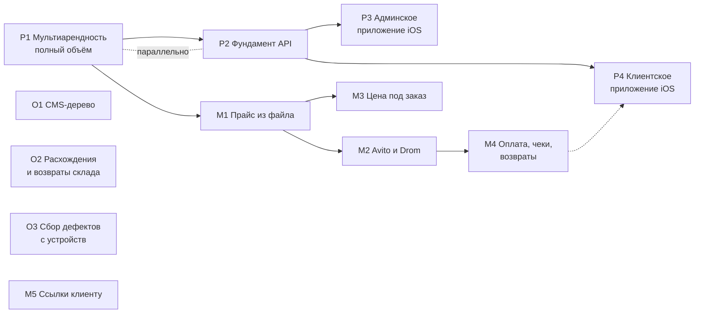

# Роадмап и бэклог

Собран 2026-09-01. Заменяет `docs/MASTER-BACKLOG.md` (составлен 2026-05-21, устарел: описанный
там как «почти не построенный» склад с тех пор построен и работает в проде).

Единственный документ, по которому видно **где мы, что дальше и какого состояния хотим
достичь**. Планы и PRD остаются источником подробностей; здесь — их порядок и состояние.

## Как это устроено

| Уровень | Что это | Где лежит |
|---|---|---|
| **PRD** | зачем и для кого; продуктовые решения владельца | `docs/prd/ГГГГ-ММ-ДД-<тема>.md` |
| **Спецификация** | как делаем: истории, файлы, критерии готовности | `docs/plans/ГГГГ-ММ-ДД-<тема>.md` |
| **Задача** | одна история внутри спецификации | пункт `- [ ] Story N` там же |

Идентификатор задачи в этом документе — **буква линии + номер** (`P1`, `M2`, `X3`). Линия
говорит, кто и когда может её взять, а не важность:

- **P — платформа.** Превращение установки одного сервиса в продукт. Идёт сейчас.
- **M — магазин и продажи.** Ждёт: владелец выбрал полный объём платформы, и это его прямая цена.
- **O — операции.** Работа сервиса изнутри: содержание сайта, склад, наблюдаемость.
- **X — хвосты.** Мелкое, конечное, часто на стороне владельца.

Состояния: **ИДЁТ** · **ГОТОВО К СТАРТУ** (спека есть, зависимости закрыты) · **ЖДЁТ**
(зависимость или решение) · **НЕТ СПЕКИ** (сначала написать) · **ЗА ВЛАДЕЛЬЦЕМ**.

## Где мы сейчас

В проде работает: публичный сайт с SEO-контуром, кабинет клиента, админка, CRM с почтой и
Telegram-уведомлениями, склад с адресным хранением и сканером, справочник номенклатуры на 442
позиции, продажа б/у запчастей вариантами, себестоимость с учётом ввоза. Реальных клиентов
трое, каталог магазина после чистки тестовых данных пуст.

Решения владельца, действующие на весь бэклог:

| Дата | Решение |
|---|---|
| 2026-08-30 | Б/у запчасти — вариантами товара, не отдельной сущностью |
| 2026-09-01 | Мультиарендность — **полный объём**, второй сервис через полгода–год |
| 2026-09-01 | Приложений два: клиентское и админское; **сначала iOS** |
| 2026-09-01 | White-label — только лендинг; консоль и кабинет платформенные |
| 2026-09-01 | Подписка на платформу продаётся на сайте, не через App Store |
| 2026-09-01 | Аккаунт Apple индивидуальный; юрлицо — при первом платящем клиенте |

## Порядок работ

**Что идёт параллельно.** P1 и P2 — одна работа с двух сторон: фундамент API становится первым
потребителем модели тенантов и разрешений, и неверная модель вскрывается на второй неделе, а не
через три месяца. Линия O ни от чего не зависит и берётся в паузах. Линия M вся ждёт P1 —
это прямая цена решения о полном объёме, записанная в PRD.

**Что нельзя делать раньше.** M4 (оплата) — до появления юрлица и эквайера у сервиса.
P3/P4 — до P2. M2 (площадки) — до M1, иначе выгружается пустота.

---

## P — платформа

### P1. Мультиарендность, полный объём — **ИДЁТ**

- **Спека:** `docs/plans/2026-07-31-multi-tenant-platform.md` (решение принято 01.09)
- **Целевое состояние:** второй сервис заводится настройками, не видит данных первого, и это
  доказано тестом, а не обещанием.
- **Вехи** (в спеке подробно): разметка 79 моделей → `tenantId` аддитивно → шов изоляции →
  RLS и runtime-роль → идентичность (Account/AuthIdentity/Session/Membership) → каталог
  разрешений → подставной второй тенант.
- **Поглощает:** `docs/plans/2026-07-30-account-split.md` (11 историй, не начат) — разделение
  учётки и человека входит в веху «идентичность». Три цели того плана остаются требованиями:
  управление учёткой в админке, смена логина отдельно от контактов CRM, слияние дублей клиентов.
- **Оценка:** 144–210 инженерных дней для команды из трёх инженеров. Для нашего режима
  календарный срок не обещаю — меряем вехами.

### P2. Фундамент мобильного API — **ГОТОВО К СТАРТУ** (идёт параллельно с P1)

- **Спека:** `docs/plans/2026-09-01-mobile-api-foundation.md` · 5 историй
- **Целевое состояние:** приложение получает данные и права по токену; версия в пути;
  токен чужого тенанта не отдаёт ни строки.
- **Почему рядом с P1, а не после:** требует ровно того, что даёт P1 — тенант в токене, права
  не из токена. Опубликованное приложение живёт на чужих телефонах месяцами, поэтому эти
  свойства нельзя добавить задним числом.

### P3. Админское приложение (iOS) — **ЖДЁТ P2**

- **Спека:** `docs/plans/2026-09-01-mobile-admin-app.md` · 8 историй
- **Целевое состояние:** кладовщик принимает поставку сканером с телефона; обрыв связи
  посреди приёмки не теряет данные и не задваивает приход.
- **Выпуск:** внутренний TestFlight не проходит ревью — сотрудники получают сборку до стора.
  Публичная публикация ждёт юрлица.

### P4. Клиентское приложение (iOS) — **ЖДЁТ P2**

- **Спека:** `docs/plans/2026-09-01-mobile-client-app.md` · 7 историй
- **Целевое состояние:** клиент получает пуш о готовой смете и соглашается с ней, не открывая
  браузер.
- **Замечание по очерёдности:** имеет смысл, когда в магазине есть товар (M1) и его можно
  оплатить (M4).

---

## M — магазин и продажи

Вся линия **ЖДЁТ**: владелец выбрал полный объём платформы, продуктовая разработка на это время
почти останавливается. Спеки написаны, чтобы работа началась с первой строки кода, а не с
постановки. Если что-то из линии понадобится Гелеотеке как боевому сервису раньше — делается
через новый фасад разрешений, не в обход.

| Ид | Что | Спека | Целевое состояние |
|---|---|---|---|
| **M1** | Прайс из файла | `2026-09-01-parts-price-import.md` | каталог наполняется файлом за минуты; повторная загрузка не плодит дублей |
| **M2** | Avito и Drom | `2026-09-01-marketplace-feeds.md` | объявления живут на площадке, обращение видно в CRM |
| **M3** | Цена под заказ | `2026-09-01-order-price-calculator.md` | цена называется с экрана, той же арифметикой, что в заказе поставщику |
| **M4** | Оплата, чеки, возвраты | `2026-09-01-payments-receipts-returns.md` | заказ оплачивается онлайн, чек приходит, возврат проводится движением по складу |
| **M5** | Ссылки клиенту в SMS и Telegram | `2026-09-01-client-links.md` | менеджер не пересылает ссылки из личного телефона |

**Блокировки сверх очереди.** M2 — адрес (переезд) и платный тариф Avito. M4 — юрлицо,
налоговый режим, эквайер, касса и ОФД.

---

## O — операции

| Ид | Что | Состояние | Документ | Целевое состояние |
|---|---|---|---|---|
| **O1** | CMS: дерево «страница → секции», предпросмотр | **ГОТОВО К СТАРТУ**, не начат | `2026-07-12-cms-admin-restructure.md` (5 задач) | правка текста идёт по странице, а не по плоскому списку ключей |
| **O2** | Склад: расхождения при приёмке и возвраты поставщику | **ГОТОВО К СТАРТУ** | `2026-09-01-receiving-discrepancies-and-returns.md` (3 истории) | принял меньше, чем в накладной — расхождение зафиксировано событием, а не подогнано количеством |
| **O3** | Сбор дефектов с живых устройств | **ГОТОВО К СТАРТУ** | `2026-09-01-client-side-defect-collector.md` (3 истории) | ошибки JS, упавшие запросы и переполнение вёрстки сами складываются в кучу; без значений полей и токенов |

O2 родился из аудита склада: инженерия там оценена на 8 из 10, UX и тесты закрыты, эти две
функции остались. O3 — из реального случая: переполнение поля даты нашлось глазами на iPhone,
а Playwright его не воспроизвёл.

---

## X — хвосты

| Ид | Что | Кто | Состояние |
|---|---|---|---|
| **X1** | Почта: перевести отправку на SMTP, убрать Resend | я + доступ | **Проверено 01.09:** `smtp.timeweb.ru:465` отвечает, авторизация проходит, видимый `From` совпадает с ящиком отправки — переключение безопасно и обратимо одним изменением обратно. Само изменение прод-конфига защита не пропустила; нужен запуск владельцем или разрешение |
| **X2** | Снять демонстрационную пару товаров | я, по слову владельца | `npx tsx prisma/seed-demo-variants.ts --remove` (файл не в репозитории) |
| **X3** | Метрика на внутренних страницах | решение владельца | счётчик стоит только в публичном слое; кабинет и админка не измеряются. Нужно решить, надо ли мерить кабинет |
| **X4** | Содержание страницы контактов | владелец | ждёт переезда |
| **X5** | Содержание статей: реальные случаи, цифры, фото | владелец | вёрстка под баунс переделана; дальше нужен фактический материал |
| **X6** | Вебмастер, Метрика, Яндекс Бизнес | владелец | хвост SEO-инициативы |
| **X7** | Справочник: S-Class и уточнения по VIN | я | хвост наполнения номенклатуры |
| ~~X8~~ | ~~Срок жизни claim-токена~~ | я | **СДЕЛАНО 01.09.** Ссылка на присвоение заказа живёт 14 дней от оформления; отдельной колонки не понадобилось — возраст токена равен возрасту заказа. Проверка стоит на обеих дверях (создание пароля и вход с привязкой). Согласование сметы гостем осознанно не ограничено: ремонт законно ждёт запчастей неделями |
| **X9** | Гостевой клейм по ссылке | я | TD-003, отложено осознанно |

---

## Разбор брошенных планов

Проверено по коду и истории, а не по галочкам.

| План | Вердикт |
|---|---|
| `2026-07-30-admin-batch-crm-seo` | **Закрыт.** Десять историй VERIFIED; одиннадцатая (выделение Account) выросла в отдельный план и теперь входит в P1 |
| `2026-07-31-platform-foundations` | **Почти закрыт.** Подтверждение email фактически сделано (`lib/email-verification/`, модель `EmailVerificationToken`, подключено в регистрации и профиле) — галочка не была проставлена. Ресурсная модель расписания тоже сделана (миграция `20260801190000_service_bay_resource_model`, `lib/scheduling/service-bays.ts` с проверкой пересечений). Остаётся Story 8 → **O3** |
| `2026-07-30-account-split` | **Поглощён P1.** Отдельно не делается: те же таблицы трогает веха идентичности |
| `2026-07-12-cms-admin-restructure` | **Не начат**, годен как есть → **O1** |
| `2026-07-17-mail-timeweb-migration` | **Код готов, хвост операционный** → **X1**. Приём писем на Timeweb IMAP работает, отправка всё ещё через Resend |
| `2026-04-16-module-boundaries-refactor` | **Архив.** SUPERSEDED с мая, структура с тех пор перестроена дважды |
| `2026-08-02-telegram-polling-handoff` | Не план, а передача сессии. Работа закрыта планом `2026-08-02-telegram-polling-fixes` |
| Планы со статусом VERIFIED и непроставленными галочками (около сорока) | **Шум, а не долг.** Галочки внутри историй — критерии приёмки, их не отмечали; сами истории приняты. Проверять их заново не нужно |

## Гигиена состояния

- Незакрытых PR нет; веток без следа в main — две, обе закрыты осознанно
  (`feat/oem-requests` вытеснена чистой веткой, `archon/...` — старый опыт с июня).
- `TODO`/`FIXME` в коде: ноль.
- `docs/tech-debt.md`: TD-001 (склад) закрыт построенным WMS; TD-002 наполовину; TD-003 живой.
- Тесты: 826 зелёных на 01.09.

## Что нужно от владельца

1. **X1** — разрешить переключение почты на SMTP (проверка уже пройдена) либо выполнить PATCH самому.
2. **X3** — мерить ли кабинет и админку Яндекс.Метрикой.
3. **X4, X5, X6** — содержание контактов и статей, кабинеты Вебмастера, Метрики и Бизнеса.
4. **M4** — юрлицо, налоговый режим, эквайер, касса и ОФД, когда линия M разморозится.
5. **P3/P4** — тип аккаунта Apple (личный или юрлицо) к моменту публичной публикации.
