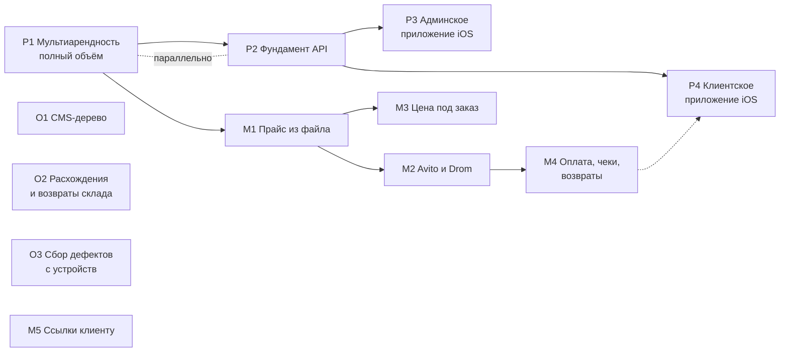

# Роадмап и бэклог

Собран 2026-09-01. Заменяет `docs/MASTER-BACKLOG.md` (составлен 2026-05-21, устарел: описанный
там как «почти не построенный» склад с тех пор построен и работает в проде).

Единственный документ, по которому видно **где мы, что дальше и какого состояния хотим
достичь**. Планы и PRD остаются источником подробностей; здесь — их порядок и состояние.

## Как это устроено

| Уровень | Что это | Где лежит |
|---|---|---|
| **PRD** | зачем и для кого; продуктовые решения владельца | `docs/prd/ГГГГ-ММ-ДД-<тема>.md` |
| **Спецификация** | как делаем: истории, файлы, критерии готовности | `docs/plans/ГГГГ-ММ-ДД-<тема>.md` |
| **Задача** | одна история внутри спецификации | пункт `- [ ] Story N` там же |

Идентификатор задачи в этом документе — **буква линии + номер** (`P1`, `M2`, `X3`). Линия
говорит, кто и когда может её взять, а не важность:

- **P — платформа.** Превращение установки одного сервиса в продукт. Идёт сейчас.
- **M — магазин и продажи.** Ждёт: владелец выбрал полный объём платформы, и это его прямая цена.
- **O — операции.** Работа сервиса изнутри: содержание сайта, склад, наблюдаемость.
- **X — хвосты.** Мелкое, конечное, часто на стороне владельца.

Состояния: **ИДЁТ** · **ГОТОВО К СТАРТУ** (спека есть, зависимости закрыты) · **ЖДЁТ**
(зависимость или решение) · **НЕТ СПЕКИ** (сначала написать) · **ЗА ВЛАДЕЛЬЦЕМ**.

## Где мы сейчас

В проде работает: публичный сайт с SEO-контуром, кабинет клиента, админка, CRM с почтой и
Telegram-уведомлениями, склад с адресным хранением и сканером, справочник номенклатуры на 442
позиции, продажа б/у запчастей вариантами, себестоимость с учётом ввоза. Реальных клиентов
трое, каталог магазина после чистки тестовых данных пуст.

Решения владельца, действующие на весь бэклог:

| Дата | Решение |
|---|---|
| 2026-08-30 | Б/у запчасти — вариантами товара, не отдельной сущностью |
| 2026-09-01 | Мультиарендность — **полный объём**, второй сервис через полгода–год |
| 2026-09-01 | Приложений два: клиентское и админское; **сначала iOS** |
| 2026-09-01 | White-label — только лендинг; консоль и кабинет платформенные |
| 2026-09-01 | Подписка на платформу продаётся на сайте, не через App Store |
| 2026-09-01 | Аккаунт Apple индивидуальный; юрлицо — при первом платящем клиенте |

## Порядок работ

**Что идёт параллельно.** P1 и P2 — одна работа с двух сторон: фундамент API становится первым
потребителем модели тенантов и разрешений, и неверная модель вскрывается на второй неделе, а не
через три месяца. Линия O ни от чего не зависит и берётся в паузах. Линия M вся ждёт P1 —
это прямая цена решения о полном объёме, записанная в PRD.

**Что нельзя делать раньше.** M4 (оплата) — до появления юрлица и эквайера у сервиса.
P3/P4 — до P2. M2 (площадки) — до M1, иначе выгружается пустота.

---

## P — платформа

### P1. Мультиарендность, полный объём — **ИДЁТ**

- **Спека:** `docs/plans/2026-07-31-multi-tenant-platform.md` (решение принято 01.09)
- **Журнал работ:** `docs/plans/2026-09-02-multi-tenant-p1.md` — 11 историй, отметка ставится
  только после выката и проверки на проде
- **Целевое состояние:** второй сервис заводится настройками, не видит данных первого, и это
  доказано тестом, а не обещанием.
- **Сделано в ночь на 02.09** (всё выкачено и проверено на проде):
  1. Классификация всех 79 моделей: GLOBAL / TENANT / TENANT_CHILD, со сторожем — новая
     таблица без класса роняет тесты.
  2. Таблица `Tenant` и запись «Гелеотека».
  3. `tenantId` на 47 корневых таблицах, внешние ключи на арендатора.
  4. `tenantId` на 26 дочерних и **составные ключи**: база отвергает привязку строки к
     родителю чужого арендатора — доказано на копии боевой схемы.
  5. Шов изоляции: условие по арендатору добавляет не автор запроса, а сам шов; живой
     негативный тест с двумя арендаторами.
  6. Контекст запроса и `tenantDb()`; **все читающие пути переведены** — модули `lib/`,
     16 публичных страниц и 67 страниц админки, кабинета и портала. Проверено обходом
     68 маршрутов с настоящим входом до и после правки: коды ответов и объём содержимого
     совпали. Откат назад закрыт храповиком.
  8. Долг проверок по роли зафиксирован числом (209) — расти больше не может.
- **Сделано сверх того 02.09:** пишущие пути на шов (49 файлов серверных действий);
  составные ключи для 52 ссылок между корневыми сущностями — смету больше нельзя привязать
  к сделке чужого арендатора; **RLS включён в бою** — 73 таблицы, соединение без арендатора
  видит ноль строк.
- **Осталось:** разделение идентичности (9), per-tenant уникальности (10, разбор готов),
  подставной второй тенант (11).
- **Оценка:** 144–210 инженерных дней для команды из трёх. Меряем вехами.

### P2. Фундамент мобильного API — **ГОТОВО К СТАРТУ** (идёт параллельно с P1)

- **Спека:** `docs/plans/2026-09-01-mobile-api-foundation.md` · 5 историй
- **Целевое состояние:** приложение получает данные и права по токену; версия в пути;
  токен чужого тенанта не отдаёт ни строки.
- **Почему рядом с P1, а не после:** требует ровно того, что даёт P1 — тенант в токене, права
  не из токена. Опубликованное приложение живёт на чужих телефонах месяцами, поэтому эти
  свойства нельзя добавить задним числом.

### P3. Админское приложение (iOS) — **ЖДЁТ P2**

- **Спека:** `docs/plans/2026-09-01-mobile-admin-app.md` · 8 историй
- **Целевое состояние:** кладовщик принимает поставку сканером с телефона; обрыв связи
  посреди приёмки не теряет данные и не задваивает приход.
- **Выпуск:** внутренний TestFlight не проходит ревью — сотрудники получают сборку до стора.
  Публичная публикация ждёт юрлица.

### P4. Клиентское приложение под брендом сервиса — **ЖДЁТ ВЫБОРА ТЕХНОЛОГИИ**

- **Спека:** `docs/plans/2026-09-01-mobile-client-app.md`
- **Решение владельца 02.09:** приложение брендируется под каждый сервис; платформенным
  остаётся только админское. Доводы: клиент ждёт приложение своего сервиса; в брендированной
  сборке нет экрана выбора арендатора; приложение — канал лидов сервиса, а не платформы.
- **Открыто:** PWA или нативная сборка. Решение о брендировании вернуло PWA в игру как
  основной вариант: нативные брендированные сборки требуют аккаунта Apple на каждый сервис
  ($99/год, Guideline 4.2.6) и подачи на ревью на каждое обновление. Рекомендация — PWA как
  база, нативная сборка платной опцией. Требуется слово владельца.
- **Следствие для P2:** объём клиентского API зависит от этого выбора; PWA переиспользует
  кабинет, нативное — требует своих эндпоинтов.
- **Замечание по очерёдности:** имеет смысл, когда в магазине есть товар (M1) и его можно
  оплатить (M4).

### P5. Универсальность продукта — **СРОЧНО В ЧАСТИ, ЧТО ВНУТРИ P1**

- **Разбор:** `docs/plans/2026-09-02-globalization.md`
- **Повод:** уточнение владельца 02.09 — продукт глобальный, Гелеотека просто оказалась в
  России. Прежние формулировки «наш рынок — российский» в документах были неверны.
- **Что дёшево сейчас и дорого потом (внутрь P1):** четыре поля на арендаторе — страна,
  валюта, локаль, часовой пояс — и валюта на денежных документах; сведение 47 мест с `₽` и
  26 с `ru-RU` к одним воротам форматирования; международный телефон вместо `+7` (сейчас
  `normalizePhone` молча превращает немецкий номер в российский). Оценка — три дня.
- **Что можно отложить без переделки:** перевод интерфейса (306 из 342 файлов `.tsx` с
  кириллицей), налоговая модель, платёжные и SMS-провайдеры на страну, фискализация,
  структурированный адрес, единицы измерения.
- **Уже сделано правильно:** деньги в минорных единицах целым числом, часовой пояс одной
  константой, VIN и OEM-номера международны по природе.

### P6. Путь наверх: дилерские центры — **НЕ В РАБОТЕ, зафиксировано направление**

- **Основание:** `docs/research/2026-09-02-competitors.md`, вопрос владельца 02.09.
- Ров дилерского сегмента в РФ — не производитель (европейские марки ушли в 2022), а
  гравитация 1С: «1С:Альфа-Авто» с обменом с «1С:Бухгалтерией», коробкой и лицензиями по
  местам. Облачный продукт бьёт по нему браузером, интерфейсом и публичным слоем.
- **Чего нет:** продажа автомобилей с trade-in, финансовые продукты при продаже, гарантийные
  обращения, нормо-часы производителей, многофилиальный учёт с консолидацией, обмен с
  «1С:Бухгалтерией», телефония, кассы с эквайрингом.
- **Что делать сейчас:** ничего сверх P1 — иерархия «холдинг → арендаторы» и права данными
  уже закладываются. Единственный пункт, который стоит поднять раньше остального дилерского,
  — обмен с «1С:Бухгалтерией»: он же нужен крупным независимым сервисам (см. O-линию).

---

## M — магазин и продажи

Вся линия **ЖДЁТ**: владелец выбрал полный объём платформы, продуктовая разработка на это время
почти останавливается. Спеки написаны, чтобы работа началась с первой строки кода, а не с
постановки. Если что-то из линии понадобится Гелеотеке как боевому сервису раньше — делается
через новый фасад разрешений, не в обход.

| Ид | Что | Спека | Целевое состояние |
|---|---|---|---|
| **M1** | Прайс из файла | `2026-09-01-parts-price-import.md` | каталог наполняется файлом за минуты; повторная загрузка не плодит дублей |
| **M2** | Avito и Drom | `2026-09-01-marketplace-feeds.md` | объявления живут на площадке, обращение видно в CRM |
| **M3** | Цена под заказ | `2026-09-01-order-price-calculator.md` | цена называется с экрана, той же арифметикой, что в заказе поставщику |
| **M4** | Оплата, чеки, возвраты | `2026-09-01-payments-receipts-returns.md` | заказ оплачивается онлайн, чек приходит, возврат проводится движением по складу |
| **M5** | Ссылки клиенту в SMS и Telegram | `2026-09-01-client-links.md` | менеджер не пересылает ссылки из личного телефона |

**Блокировки сверх очереди.** M2 — адрес (переезд) и платный тариф Avito. M4 — юрлицо,
налоговый режим, эквайер, касса и ОФД.

---

## O — операции

| Ид | Что | Состояние | Документ | Целевое состояние |
|---|---|---|---|---|
| **O1** | CMS: дерево «страница → секции», предпросмотр | **ГОТОВО К СТАРТУ**, не начат | `2026-07-12-cms-admin-restructure.md` (5 задач) | правка текста идёт по странице, а не по плоскому списку ключей |
| **O2** | Склад: расхождения при приёмке и возвраты поставщику | **ГОТОВО К СТАРТУ** | `2026-09-01-receiving-discrepancies-and-returns.md` (3 истории) | принял меньше, чем в накладной — расхождение зафиксировано событием, а не подогнано количеством |
| **O3** | Сбор дефектов с живых устройств | **ГОТОВО К СТАРТУ** | `2026-09-01-client-side-defect-collector.md` (3 истории) | ошибки JS, упавшие запросы и переполнение вёрстки сами складываются в кучу; без значений полей и токенов |

O2 родился из аудита склада: инженерия там оценена на 8 из 10, UX и тесты закрыты, эти две
функции остались. O3 — из реального случая: переполнение поля даты нашлось глазами на iPhone,
а Playwright его не воспроизвёл.

---

## X — хвосты

| Ид | Что | Кто | Состояние |
|---|---|---|---|
| ~~X1~~ | ~~Почта: уйти с Resend~~ | **СДЕЛАНО 01.09** | Поддержка Timeweb открыла исходящий SMTP по обращению владельца — блокировка снята как класс (и до `smtp.timeweb.ru`, и до Gmail). Отправка переведена на SMTP: приложение отвечает `transport: smtp, code: ok, authenticated: true`, соединение и авторизация проходят за 3 с вместо прежнего 46-секундного таймаута. Resend больше не используется — провайдеро-независимость достигнута. Остаётся проверить фактическую доставку первым живым письмом; проверка транспорта — `POST /api/internal/email/self-test` |
| ~~X2~~ | ~~Демонстрационная пара товаров~~ | — | **СНЯТО 01.09** по слову владельца: две позиции удалены с прода вместе с остатками, страница демо-товара отдаёт 404 |
| ~~X3~~ | ~~Метрика на внутренних страницах~~ | — | **НЕ ДЕЛАЕМ** (решение владельца 01.09). Счётчик остаётся только в публичном слое: кабинет и админка — рабочие экраны, мерить там нечего |
| **X4** | Содержание страницы контактов | владелец | ждёт переезда |
| **X5** | Содержание статей | **я** (решение владельца 01.09) | вёрстка под баунс переделана, дальше содержание. Пишу техническую фактуру: симптомы, причины, порядок работ, наши цены и номенклатура. Чего НЕ будет — выдуманных случаев из практики, цифр «отремонтировали N машин» и чужих фотографий: это подделка отзывов, а не контент |
| **X6** | Яндекс Бизнес | владелец, **ждёт X4** | Вебмастер и Метрика подключены и работают (в настройках прода живые `YANDEX_METRIKA_ID` и OAuth-токен Вебмастера). Остаётся карточка организации в Яндекс Бизнесе, а ей нужен настоящий адрес — то есть до конца переезда её заводить нельзя |
| **X7** | Справочник: S-Class и уточнения по VIN | я | хвост наполнения номенклатуры |
| ~~X8~~ | ~~Срок жизни claim-токена~~ | я | **СДЕЛАНО 01.09.** Ссылка на присвоение заказа живёт 14 дней от оформления; отдельной колонки не понадобилось — возраст токена равен возрасту заказа. Проверка стоит на обеих дверях (создание пароля и вход с привязкой). Согласование сметы гостем осознанно не ограничено: ремонт законно ждёт запчастей неделями |
| **X9** | Гостевой клейм по ссылке | я | TD-003, отложено осознанно |

---

## Разбор брошенных планов

Проверено по коду и истории, а не по галочкам.

| План | Вердикт |
|---|---|
| `2026-07-30-admin-batch-crm-seo` | **Закрыт.** Десять историй VERIFIED; одиннадцатая (выделение Account) выросла в отдельный план и теперь входит в P1 |
| `2026-07-31-platform-foundations` | **Почти закрыт.** Подтверждение email фактически сделано (`lib/email-verification/`, модель `EmailVerificationToken`, подключено в регистрации и профиле) — галочка не была проставлена. Ресурсная модель расписания тоже сделана (миграция `20260801190000_service_bay_resource_model`, `lib/scheduling/service-bays.ts` с проверкой пересечений). Остаётся Story 8 → **O3** |
| `2026-07-30-account-split` | **Поглощён P1.** Отдельно не делается: те же таблицы трогает веха идентичности |
| `2026-07-12-cms-admin-restructure` | **Не начат**, годен как есть → **O1** |
| `2026-07-17-mail-timeweb-migration` | **Код готов, хвост операционный** → **X1**. Приём писем на Timeweb IMAP работает, отправка всё ещё через Resend |
| `2026-04-16-module-boundaries-refactor` | **Архив.** SUPERSEDED с мая, структура с тех пор перестроена дважды |
| `2026-08-02-telegram-polling-handoff` | Не план, а передача сессии. Работа закрыта планом `2026-08-02-telegram-polling-fixes` |
| Планы со статусом VERIFIED и непроставленными галочками (около сорока) | **Шум, а не долг.** Галочки внутри историй — критерии приёмки, их не отмечали; сами истории приняты. Проверять их заново не нужно |

## Найдено попутно

**Переменные окружения могут не доехать до контейнера, если деплои наложились.** 01.09 откат
`EMAIL_TRANSPORT` на `resend` показывался в ответе API, но приложение продолжало работать со
старым значением: его деплой был вытеснен следующим, а `env_version` не сдвинулся. Помог только
отдельный PATCH. Вывод для эксплуатации: после смены конфига проверять **фактическое состояние
из приложения**, а не ответ API — для почты это `POST /api/internal/email/self-test`.

## Найдено и починено попутно

**Тесты не запускались в CI вовсе.** Workflow делал `prisma generate`, `tsc` и `lint` — и всё.
Почти тысяча проверок существовала, но мержем не гейтилась: гарантия держалась на том, что
автор прогонит их у себя. Теперь в CI поднимается настоящий Postgres той же версии, что в бою,
и живые тесты (изоляция арендаторов, гонка за пост) выполняются по-настоящему.

## Гигиена состояния

- Незакрытых PR нет; веток без следа в main — две, обе закрыты осознанно
  (`feat/oem-requests` вытеснена чистой веткой, `archon/...` — старый опыт с июня).
- `TODO`/`FIXME` в коде: ноль.
- `docs/tech-debt.md`: TD-001 (склад) закрыт построенным WMS; TD-002 наполовину; TD-003 живой.
- Тесты: 826 зелёных на 01.09.

## Что нужно от владельца

1. **X3** — мерить ли кабинет и админку Яндекс.Метрикой.
2. **X4, X5, X6** — содержание контактов и статей, кабинеты Вебмастера, Метрики и Бизнеса.
3. **M4** — юрлицо, налоговый режим, эквайер, касса и ОФД, когда линия M разморозится.
4. **P3/P4** — тип аккаунта Apple (личный или юрлицо) к моменту публичной публикации.
