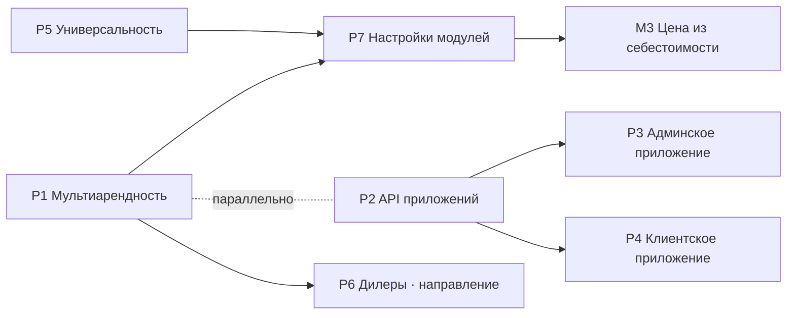

# Роадмап

Обновлён: 2026-09-02

## Как читать

Один файл вместо трёх источников правды. Здесь **только незакрытое**: что сделано — в истории
и в ledger'ах планов, повторять это тут смысла нет.

Каждая работа названа буквой линии и номером: `P3`, `M4`, `O2`. Это имя не меняется — на него
можно ссылаться в разговоре и в задачах. Спека у каждой либо есть (тогда работа начинается с
первой строки кода), либо честно помечено, что её нет.

**Состояния:** `ИДЁТ` · `ГОТОВО К СТАРТУ` (спека есть, зависимости закрыты) · `ЖДЁТ X` (есть
блокирующая зависимость) · `ЖДЁТ РЕШЕНИЯ` (нужно слово владельца) · `НАПРАВЛЕНИЕ` (не в работе,
зафиксировано, чтобы не переделывать потом).

---

## Пять линий

**P — платформа.** Всё, что делает продукт продаваемым не одной Гелеотеке. Сейчас это главная
линия; пока она не закрыта, второй клиент невозможен.

**M — магазин и продажи.** Приносит деньги Гелеотеке и будет приносить любому сервису.

**O — операции.** Внутренняя работа сервиса: склад, содержимое сайта, диагностика.

**X — хвосты.** Мелочи с известным владельцем, часть за мной, часть за вами.

**Что идёт параллельно.** P1 и P2 — одна работа с двух сторон: мобильный эндпоинт становится
первым потребителем модели разрешений, и неверная модель вскроется на второй неделе, а не через
три месяца. Линия M почти вся ждёт: владелец выбрал полный объём платформы, и это принятая цена.

---

## P — платформа

### P1. Мультиарендность — **ИДЁТ**, 7 из 11 историй в бою

Ledger: `docs/plans/2026-09-02-multi-tenant-p1.md`. Архитектура: `2026-07-31-multi-tenant-platform.md`.

**Сделано и работает в бою:** классификация 79 моделей, таблица арендаторов, `tenantId` на 73
таблицах, 26 составных ключей родитель-ребёнок и 52 между корнями, шов изоляции на всех путях
кроме семи осознанных исключений, RLS на 73 таблицах, нумерация документов на арендатора.

**Осталось, по порядку:**

| Ид | Что | Состояние | Почему в этом порядке |
|---|---|---|---|
| **P1.8** | Каталог разрешений вместо ролей | ЧАСТИЧНО: фасад есть, долг 209 мест `requireRole` зафиксирован храповиком | Перевод самих мест — работа с владельцем: ошибка в отображении роли на разрешение запирает админку |
| **P1.9** | Идентичность: Account / AuthIdentity / Membership | ГОТОВО К СТАРТУ | Один человек в двух сервисах — это членства, а не две учётки. Нужна до второго арендатора и до клиентского приложения |
| **P1.10** | Остаток уникальностей на арендатора | ПЕРВАЯ ГРУППА СДЕЛАНА | Адреса страниц ждут решения о доменах; email и телефон делаются ПОСЛЕДНИМИ — они вход |
| **P1.11** | Подставной второй арендатор | ЖДЁТ P1.9, P1.10 | Это и есть доказательство, что всё выше работает |

### P5. Универсальность продукта — **ИДЁТ**

Разбор: `docs/plans/2026-09-02-globalization.md`.

**Сделано:** страна, валюта, локаль и часовой пояс на арендаторе; валюта на денежных
документах; ворота форматирования; настройки доходят до интерфейса; `<html lang>` из локали;
храповик на зашитую Россию (26 мест с `₽`, 25 с `ru-RU`, 2 с поясом, 6 с кодом валюты);
данные первого клиента вынесены из кода платформы; содержимое сайта перенесено в базу, а
умолчания стали платформенными.

**Осталось:**

| Ид | Что | Состояние | Объём |
|---|---|---|---|
| **P5.1** | Телефон в международном формате | ГОТОВО К СТАРТУ | день. Сейчас `normalizePhone` молча превращает немецкий номер в российский (29 мест). Нужна `libphonenumber-js` — это новая зависимость, и путь входа, поэтому аккуратно |
| **P5.2** | Налоговая модель | ЖДЁТ P7 | ставка на арендаторе, цена с налогом или без. Сейчас 20% зашиты умолчанием в схеме и уже неактуальны |
| **P5.3** | Погашение долга зашитой России | ГОТОВО К СТАРТУ, фоновая | 26 + 25 мест перевести на ворота. Храповик не даёт долгу расти, так что это не срочно |
| **P5.4** | Перевод интерфейса | НАПРАВЛЕНИЕ | 306 файлов из 342 с кириллицей. Самая большая и самая механическая работа; делается, когда появится неруcскоязычный клиент. Половинчатый перевод хуже отсутствующего |

### P7. Настройки модулей и способности — **ГОТОВО К СТАРТУ**

Разборы: `2026-09-02-module-settings-audit.md`, `2026-09-02-tenant-specific-functionality.md`.

Модули (сервис, запчасти, аренда) подписываются отдельно — значит у каждого свой раздел
настроек. Ревизия показала: в настройках платформы модульного почти нет, зато **бизнес-параметры
модулей вообще не являются настройками** — они константы в коде, и владелец сервиса не может их
изменить. Закономерность говорящая: зашито именно то, о чём у него есть мнение (часы приёма,
длина слота, порог остатка, ставка налога), а вынесено то, о чём мнения нет (хост IMAP, секрет
вебхука).

| Ид | Что | Объём |
|---|---|---|
| **P7.1** | Механизм: раздел настроек на модуль, права на раздел, умолчания | день-два |
| **P7.2** | Способности как данные арендатора, включение по факту, а не галочкой | день |
| **P7.3** | Перенос констант в настройки, по модулю за раз | день на модуль |

Правило, которое здесь важнее кода: способность гейтит показ и необязательные модули, но **не
ядро** — изоляция, права, нумерация и целостность склада одни для всех. На это будет сторож.

### P2. Фундамент API приложений — **ГОТОВО К СТАРТУ**, идёт параллельно с P1

Спека: `2026-09-01-mobile-api-foundation.md`. Требует шагов из P1: арендатор в токене, права не
из токена, серверная проверка разрешений.

### P3. Админское приложение (iOS) — **ЖДЁТ P2**

Спека: `2026-09-01-mobile-admin-app.md`. Приложение платформенное: приёмщик, механик, сканер
VIN и госномера, фотоосмотр.

### P4. Клиентское приложение — **ЖДЁТ РЕШЕНИЯ О ТЕХНОЛОГИИ**

Спека: `2026-09-01-mobile-client-app.md`. Решение владельца 02.09: приложение брендируется под
каждый сервис, платформенным остаётся только админское.

Открыто одно: **PWA или нативная сборка**. Решение о брендировании вернуло PWA в игру как
основной вариант — нативные брендированные сборки требуют аккаунта Apple на каждый сервис
($99/год, Guideline 4.2.6) и подачи на ревью у каждого клиента на каждое обновление.
Рекомендация: PWA как база, нативная сборка платной опцией.

### P6. Дилерские центры — **НАПРАВЛЕНИЕ**, не в работе

Разбор: `docs/research/2026-09-02-competitors.md`. Ров сегмента в России — не производитель
(марки ушли в 2022), а гравитация 1С. Чего нет: продажа автомобилей с trade-in, финансовые
продукты, гарантийные обращения, нормо-часы производителей, многофилиальный учёт, обмен с
«1С:Бухгалтерией». Фундамент P1 для дилерского холдинга уже правильной формы — перекрашивать не
придётся.

---

## M — магазин и продажи

Линия почти вся ждёт: полный объём платформы — принятая цена. Спеки написаны заранее, чтобы
работа началась с кода.

| Ид | Что | Состояние | Спека |
|---|---|---|---|
| **M3** | Цена из себестоимости: маржа, налог, признак устаревшей цены | ЖДЁТ P7 | `2026-09-02-price-from-cost.md` |
| **M3в** | Валютный слой: закупка в одной валюте, продажа в другой | ЖДЁТ M3 | там же, слой 2 — включается сам при закупках в чужой валюте |
| **M1** | Прайс из файла | ЖДЁТ | `2026-09-01-parts-price-import.md` |
| **M2** | Avito и Drom | ЖДЁТ адреса и тарифа | `2026-09-01-marketplace-feeds.md` |
| **M4** | Оплата, чеки, возвраты | ЖДЁТ реквизитов | `2026-09-01-payments-receipts-returns.md` |
| **M5** | Ссылки клиенту в SMS и Telegram | ЖДЁТ | `2026-09-01-client-links.md` |
| **M6** | Цена под заказ с экрана | ЖДЁТ M3 | `2026-09-01-order-price-calculator.md` |

**Первым в линии — M3.** Он даёт менеджеру то, чего сегодня нет вовсе: себестоимость рядом с
ценой. И он же нужен всем сервисам, а не только Гелеотеке.

---

## O — операции

| Ид | Что | Состояние | Спека |
|---|---|---|---|
| **O2** | Склад: расхождения при приёмке и возвраты поставщику | ГОТОВО К СТАРТУ | `2026-09-01-receiving-discrepancies-and-returns.md` |
| **O1** | CMS: дерево «страница → секции», предпросмотр | ГОТОВО К СТАРТУ | `2026-07-12-cms-admin-restructure.md` |
| **O3** | Сбор дефектов с живых устройств | ГОТОВО К СТАРТУ | `2026-09-01-client-side-defect-collector.md` |
| **O4** | Почтовые умолчания в настройки | ГОТОВО К СТАРТУ, спеки нет | Адрес получателя входящих и адрес для ответов — последние два места в списке исключений сторожа утечек. Трогать вместе с разбором почтовых настроек: ошибка стоит доставки писем |

O1 стал полезнее после переноса содержимого в базу: теперь редактируется всё, а не 15 ключей
из 96.

---

## X — хвосты

| Ид | Что | Кто | Состояние |
|---|---|---|---|
| **X4** | Содержание страницы контактов | владелец | ждёт переезда |
| **X5** | Содержание статей | я | вёрстка сделана, дальше техническая фактура: симптомы, причины, порядок работ, наши цены. Выдуманных случаев и цифр «отремонтировали N машин» не будет — это подделка |
| **X6** | Яндекс Бизнес | владелец | ждёт X4: карточке нужен настоящий адрес |
| **X7** | Справочник: S-Class и уточнения по VIN | я | хвост наполнения номенклатуры |
| **X9** | Гостевой клейм по ссылке | я | TD-003, отложено осознанно |

---

## Что ждёт вашего решения

Без этих ответов работа встанет или пойдёт не туда.

1. **P4** — PWA или нативная сборка для клиентского приложения. Рекомендация: PWA как база,
   нативная платной опцией.
2. **P7** — способности входят в подписку или продаются старшим тарифом. От ответа зависит,
   показывать ли выключенную способность как «доступно в тарифе выше» или не показывать вовсе.
3. **P1.10** — решение о доменах: свой домен на сервис или поддомен платформы. Блокирует
   адреса страниц на арендатора.
4. **M4** — юрлицо, налоговый режим, эквайер, касса и ОФД, когда линия M разморозится.
5. **X4, X6** — контакты и карточка в Яндекс Бизнесе после переезда.

---

## Ближайшие шаги

Если ничего не менять, порядок такой:

1. **P1.9** — идентичность. Она нужна и второму арендатору, и клиентскому приложению, и слиянию
   дублей клиентов. Самая дорогая из оставшихся в P1 и самая блокирующая.
2. **P7.1 и P7.2** — механизм настроек модулей и способностей. Разблокирует M3 и делает
   продукт продаваемым модулями.
3. **P5.1** — телефон в международном формате. День работы, а без него первый неруcский клиент
   получит испорченные номера.
4. **M3** — цена из себестоимости. Первая за долгое время работа, которую видно менеджеру.
5. **P1.10 и P1.11** — остаток уникальностей и подставной второй арендатор как доказательство.

P2 идёт параллельно всему этому, когда до него дойдут руки.
